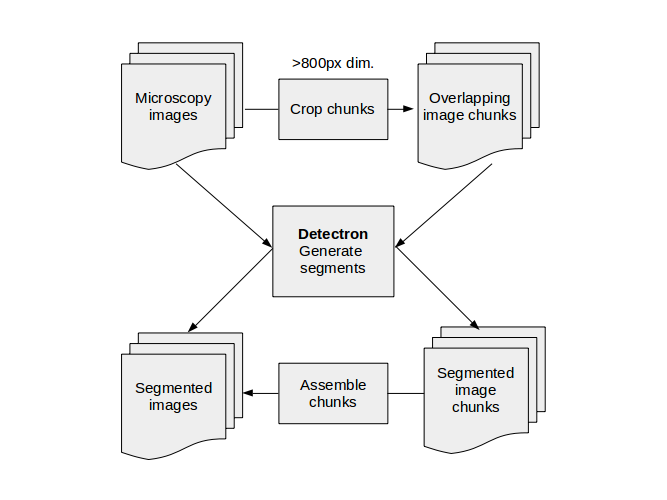
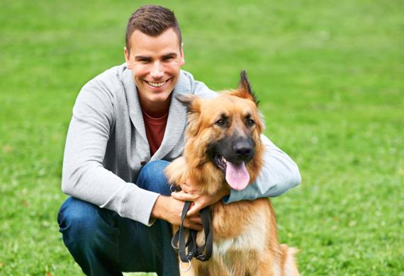
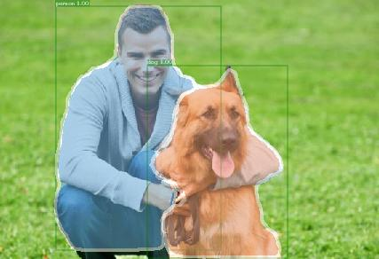
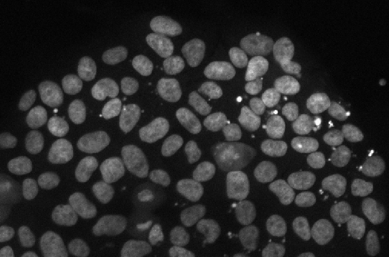
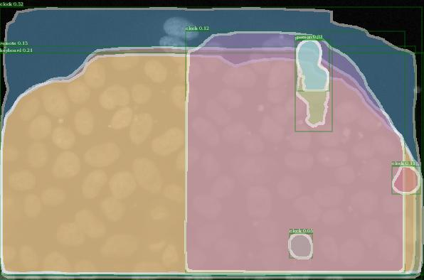

# CakeCell
Segmenting cells (and other objects!) in microscopy images via neural networks.

<b> Hackathon team: Jay Newby (Lead), Ben Walker (Sys Admin), Mike Pablo (Writer),  Sherry Chao, Ian Seim </b>

## The idea
Identifying objects of interest in microscopy data is a critical task, but it is time-consuming and subject to variability over time and between researchers. We'd like to automatically segment microscopy images <i> generically</i>.

## Why CakeCell?
One of our earliest attempts at segmenting microscopy images <i> without training on microscopy images with labeled cells </i> produced some cell-like segmentations (a couple of cells were labeled as clocks), and some hilariously bad segmentations (much of the field of view was labeled as a [cake](images/cells2_1.jpg.pdf)!).

## Design and testing
Our two test image sets are of filaments and stem cells:

<div align="center">
   <n>
  
</div>

To perform generic segmentation, we're using <a href="https://github.com/facebookresearch/Detectron">Detectron</a>, Facebook AI Research's "software system that implements state-of-the-art object detection algorithms", including Mask R-CNN. An early form of this approach, DeepMask, was able to segment even objects that were not originally in the training data set (Fig. 2 in [Learning to Segment Object Candidates](https://arxiv.org/abs/1506.06204)). In the same spirit, we want to see whether Detectron can segment biological objects without any microscopy training data.

<div align="center">

</div>

## Dependencies
[Detectron](https://github.com/facebookresearch/Detectron) is a software system for object detection.
As described on their [installation page](https://github.com/facebookresearch/Detectron/blob/master/INSTALL.md)
  - Requires a NVIDIA GPU, Linux, Python2.
  - Requires Caffe2, various standard Python packages, and the COCO API.

## Workflow diagram
<div align="center">
  
</div>

## Workflow method
Currently, we are simply submitting individual images to Detectron, without pre-processing steps. Once we move beyond analyzing images one-at-a-time, we'll want to keep our images below a certain size.

### Currently...
1. Submit images to Detectron and look at the segmentation mask.

### In the future...
1. For any images with an oversized dimension, crop into a set of overlapping chunks.
2. Submit images to Detectron and extract generate segmentation masks
3. For any images composed of overlapping chunks, reassemble them.
    - Combine segments if at least one pixel in the segment mask is shared between chunks.

## Installation
_A brief installation process is as follows. For more help,_ [read more](centos_install.md).

On a CentOS 7 with an NVIDIA GPU...
1. Install latest NVIDIA driver.
2. Install CUDA 9.1 on the system.
3. Install Docker CE (17.12.1).
4. Install NVIDIA-Docker 2.
5. Clone the Detectron repo.
6. Build the Docker file in the Detectron folder
```bash
cd docker
docker build -t detectron .
```
7. Run tests
```bash
mkdir docker_mount
nvidia-docker run --rm -it -v ${PWD}/docker_mount:/mnt detectron
python2 tools/infer_simple.py
  --cfg  configs/12_2017_baselines/e2e_mask_rcnn_R-101-FPN_2x.yaml \
  --output-dir /mnt/detectron-visualizations \
  --image-ext jpg \
  --wts https://s3-us-west-2.amazonaws.com/detectron/35861858/12_2017_baselines/e2e_mask_rcnn_R-101-FPN_2x.yaml.02_32_51.SgT4y1cO/output/train/coco_2014_train:coco_2014_valminusminival/generalized_rcnn/model_final.pkl
  demo
```
  - This will put the demo output in the docker_mount folder.

## Use cases
We foresee our approach being useful for image data where...
- manual segmentation is needed but problematic (time, difficulty, ...), and
- there are not enough examples to train a classifier directly on the dataset

Our focus is currently on serving the biological microscopy community, but segmenting objects within images without specifically training on those objects has even broader applications.

## Input format
So far we have tested .jpg files. Other image formats TBD.

## Output
Person and dog are _labels_ within the COCO dataset used to train Detectron. As expected it easily infers the correct segmentation and labels.
<div align="center">
  
  
</div>

Tardigrades are no problem:
<div align="center">
  
  
</div>

These stem cells are not within the COCO dataset, so we don't expect correct labeling, but we're hoping for accurate segmentation.

<div align="center">
  
  
</div>

There's still a lot of work to be done, but a couple of the cells get reasonably segmented, despite being labeled as clocks!

## Validation
Currently, we're learning what seems to work and what doesn't just by looking at the Detectron's analysis of our test images. Of course, more robust validation metrics will be important moving forward (e.g. annotated microscopy image sets).

## Future
1. Migrating to an Amazon Web Server
2. Exploring internal features of Detectron (rather than the final segmentation output) as alternatives for segmenting objects generically.
3. "Tricking" Detectron into segmenting our objects by choosing appropriate color lookup tables.

## FAQ
Q: I'm having trouble installing.
A: Our experience in getting Detectron running is documented [here](centos_install.md), and much more detail is available at via [Detectron itself](https://github.com/facebookresearch/Detectron/blob/master/INSTALL.md).

Q: Shouldn't you actually train your system to recognize cells instead?
A: We're definitely excited about taking this approach, but our initial idea was to see whether Detectron would be able to identify cells without additional training, in the same way [DeepMask](https://arxiv.org/pdf/1506.06204.pdf) could identify monkeys without prior training. Having found this to not work on our first try, we're interested in seeing whether we can 'trick' Detectron into recognizing specific structures by pseudocoloring images (i.e. using a LUT).

## References
- [Detectron](https://github.com/facebookresearch/detectron). Ross Girshick, Ilija Radosavovic, Georgia Gkioxari, Piotr Dollár and Kaiming He. 2018.
- [Learning to Segment Object Candidates](https://arxiv.org/abs/1506.06204). Pedro O. Pinheiro, Ronan Collobert, and Piotr Dollár. arXiv, 2015.
- [Mask R-CNN](https://arxiv.org/pdf/1703.06870.pdf). Kaiming He, Georgia Gkioxari, Piotr Dollár, Ross Girshick. arVix, 2018.

## People
- [Jay Newby](http://newby.web.unc.edu/), UNC, Chapel Hill, NC, jaynewby@email.unc.edu
- [Ben Walker](https://github.com/bwalker1), UNC, Chapel Hill, NC, walkeb6@live.unc.edu
- [Mike Pablo](http://github.com/mikepab), UNC, Chapel Hill, NC, mikepab@live.unc.edu
- [Sherry Chao](http://github.com/shark8078), UNC, Chapel Hill, NC, hchao@email.unc.edu
- [Ian Seim](https://github.com/iseim), UNC, Chapel Hill, NC, iseim@live.unc.edu
